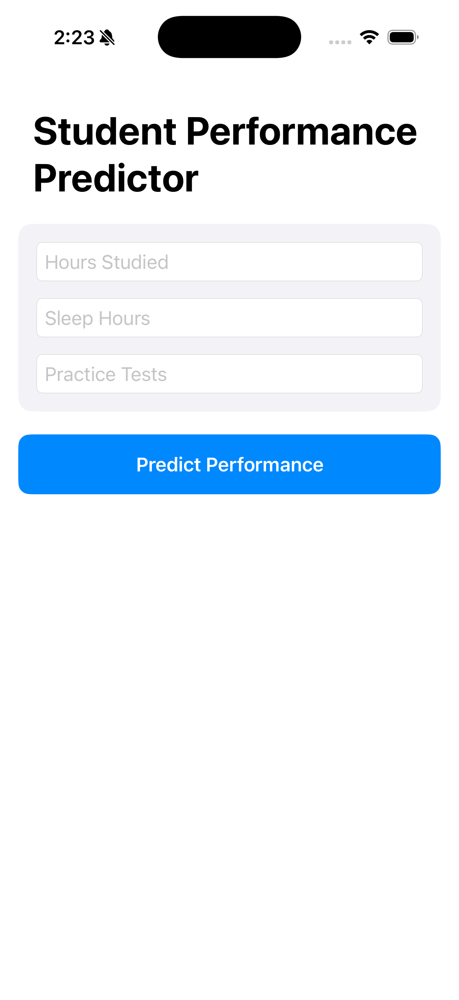
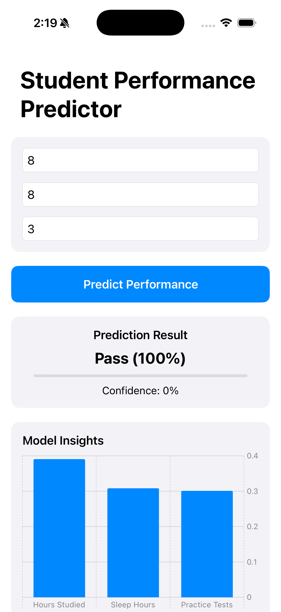
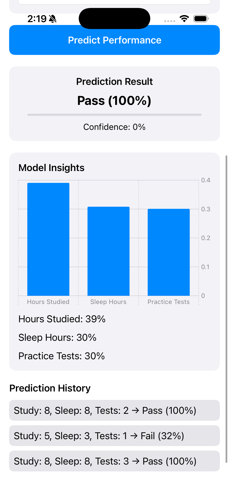
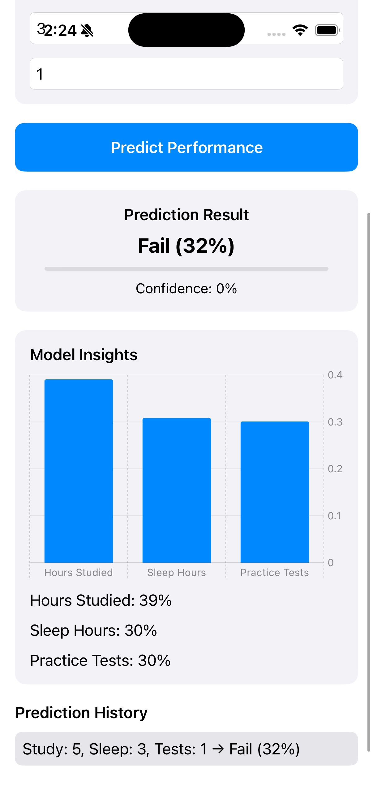

# Student Performance Predictor (AI + iOS App)

An end-to-end AI-powered iOS application that predicts whether a student will **pass or fail** based on study patterns.
The app communicates with a deployed **FastAPI backend** that runs a trained machine learning model.

This project demonstrates how to integrate **Machine Learning + Backend API + iOS App** in a real-world architecture.

---

## Demo Video

Watch the application demo below:

demo-video.mov

This video shows:

- Entering student study details
- Sending request to ML backend
- Receiving prediction and confidence
- Visualizing feature importance
- Viewing prediction history

---

## Architecture

iOS App (SwiftUI)
↓
REST API Request
↓
FastAPI Backend (Cloud Deployment)
↓
Machine Learning Model (Scikit-learn)
↓
Prediction + Confidence + Insights returned to App

---

## Tech Stack

SwiftUI (iOS App)
Python
FastAPI
Scikit-learn
REST APIs
Machine Learning
Cloud Deployment

---

## Features

- AI-based student performance prediction
- Confidence score for predictions
- Feature importance visualization using charts
- Prediction history tracking
- Cloud-hosted backend API
- Clean and responsive SwiftUI UI

---

## App Screenshots

  
  
  

  
  

---

## Project Structure

student-performance-ai-app/

backend/ → Backend development and training-related code
ios-app/ → SwiftUI iOS application
main.py → Production FastAPI server used for deployment
model.pkl → Trained machine learning model
requirements.txt → Python dependencies
screenshots/ → Application screenshots
demo-video.mov → Application demo video

---

## What I Learned From This Project

- Deploying machine learning models with FastAPI
- Integrating AI backend with iOS applications
- Designing REST APIs for ML predictions
- Visualizing model insights inside mobile apps
- Building an end-to-end AI application

---

## Future Improvements

- Add SHAP-based prediction explanations
- Improve model accuracy with larger datasets
- Add analytics dashboard for predictions
- Add user authentication
- Store prediction history in database

---

## Author

Akshay Kumar
iOS Developer transitioning into AI Engineering
